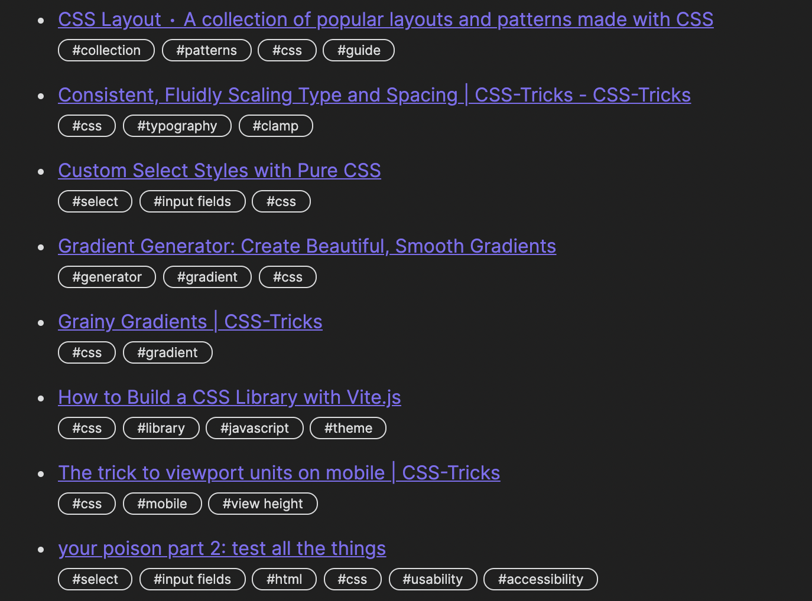
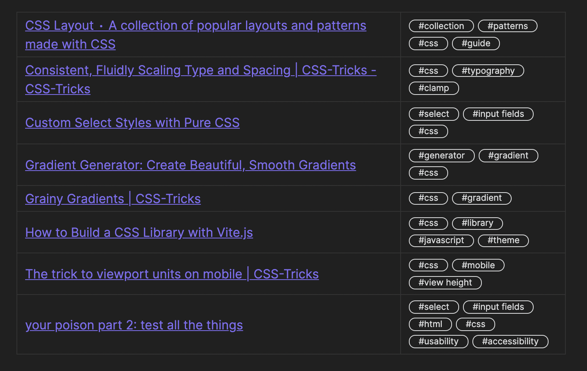

# Obsidian Raindrop Plugin
This plugin allows for basic integration with [Raindrop.io](https://raindrop.io), a bookmarking service and [Obsidian](https://obsidian.md).

## Current Features
- Create a codeblock to display a list of links from your Raindrop account that matches the provided search filters

## Planned Features
- Create Raindrop bookmark from link within Obsidian
	- Obsidian internal links
	- External links
- Create note from bookmark

## Example
<pre>
```raindrop
collection: 0
format: table
search: #css
sort: title
```
</pre>

### List View


### Table View

  

### Codeblock Options
| key        | optional | values                                                                           | effect                                                                                         |
| ---------- |:--------:| -------------------------------------------------------------------------------- | ---------------------------------------------------------------------------------------------- |
| collection |    Y     | number representing the collection ID                                | limit the search query to this collection; defaults to 0 (all)                                     |
| format     |    Y     | 'list' or 'table'                                                                | show the results as a list or a table; defaults to 'list'                                      |
| sort       |    Y     | [See Raindrop Sort Options](https://developer.raindrop.io/v1/raindrops/multiple) | Sets the sort order of the search results; defaults to '-created' (descending by created date) |
| search     |    N     | [See Raindrop Search Examples](https://help.raindrop.io/using-search/#operators) | A text search query just as you would enter in the Raindrop UI to return a list of bookmarks   |
| showTags   |    Y     | 'true' or 'false'                                                                | Displays tags for each bookmark; defaults to true                                              |

#### Finding the collection ID
1. Visit your raindrop collection via the website, e.g. https://app.raindrop.io/my/15660833
2. The string of numbers after '/my/' is your collection ID
3. There are a few special collection IDs which can be used:

   | ID  | Collection    |
   |:---:| ------------- |
   |  0  | All bookmarks |
   | -1  | Unsorted      |
   | -99 | Trash              |

## Plugin Setup
After installing the plugin, you will need to setup a new app in your Raindrop account. Once you have completed this step, you can use your new app's test account key for access to the API.

### Raindrop Test Token

I elected to not use the OAuth mechanism that the Raindrop API offers to avoid maintaining my own middleware.

1. Access the [Integrations](https://app.raindrop.io/settings/integrations) section of your Raindrop account
2. Click "Create new app"
3. Copy the "Test token"

In the plugin settings you can paste this test key to interact without needing to directly login with Raindrop.


### Bookmark List Refresh Interval

Your bookmarks will automatically refresh from Raindrop in the background for the current note. Set the number of minutes here for how often to check Raindrop for new links in the search codeblock of any active notes.